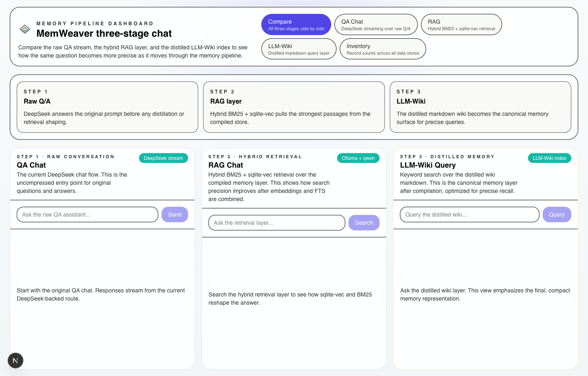
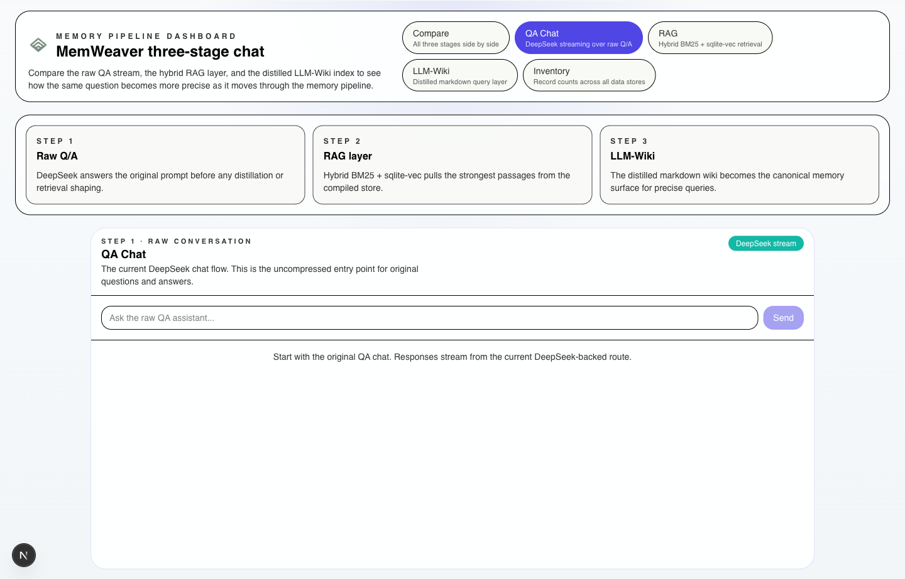
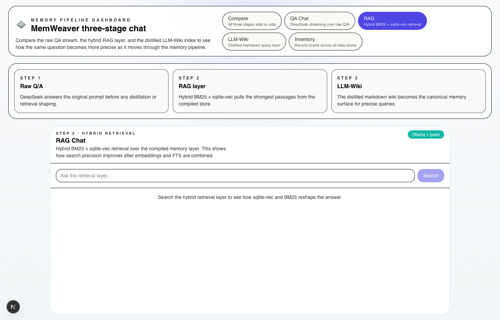
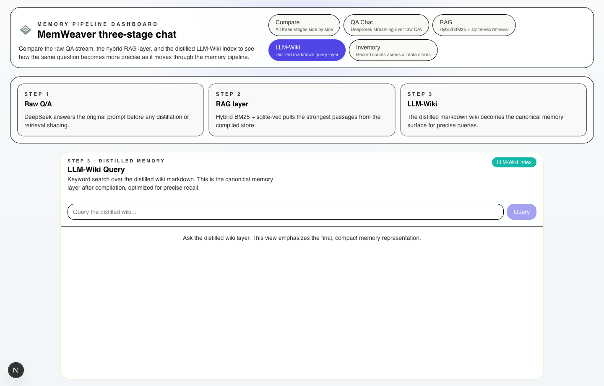
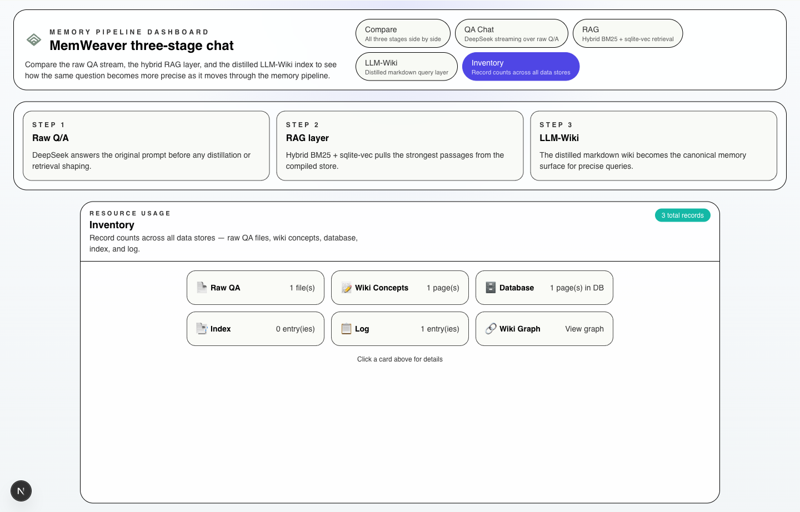

# LLM-Wiki Middleware Delegator

FastAPI backend + Next.js 16 chat frontend + stdio MCP server implementing a **dual-LLM memory pipeline** ([`docs/research/v2/s2-claude-plan.md`](docs/research/v2/s2-claude-plan.md)). Ingest Q/A pairs, search via FTS5 + vector embeddings, and chat with wiki-memory augmented LLM — **DeepSeek** serves public chat while **Ollama** handles the ingest pipeline, wiki compilation, and semantic embeddings.

Current release: [v0.1.0](CHANGELOG.md). For release history, see [CHANGELOG.md](CHANGELOG.md), [docs/roadmap.md](docs/roadmap.md), and [docs/adr/](docs/adr/).
For a single entry point into the docs structure, see [docs/README.md](docs/README.md).

## What’s Included

- **5-tab dashboard** (Compare / QA Chat / RAG / LLM-Wiki / Inventory) — compare raw QA streaming, hybrid retrieval, distilled wiki, and system resource usage side by side
- `POST /chat` streams answers via **DeepSeek** (SSE) with wiki context injection; saving to memory is **opt-in**
- `POST /ingest` queues Q/A pairs for async wiki compilation via Ollama
- `GET /query` supports keyword, semantic, and hybrid search modes
- `GET /wiki/{slug}`, `GET /wiki/graph`, `GET /wiki/tree`, `GET /health`, `GET /stats`, and `GET /inventory` expose wiki content, graph, tree catalog, service status, and data-store record counts
- `wiki_search`, `wiki_ingest`, `wiki_get_page`, and `wiki_stats` are available through the stdio MCP server for IDE integrations

## Architecture

```
┌─────────────────────────────────────────────────────┐
│  Browser (http://localhost:3000)                     │
│  ┌──────────────────┐  ┌─────────────────────────┐  │
│  │   ChatWindow      │  │   WikiSidebar           │  │
│  │   (messages +     │  │   (renders wiki.md      │  │
│  │    input bar)     │  │    content)             │  │
│  └────────┬─────────┘  └────────▲────────────────┘  │
│           │ POST /api/chat      │ GET /wiki/{slug}  │
└───────────┼──────────────────────┼──────────────────┘
            │ (Next.js Route       │ (direct fetch)
            │  Handler proxy)      │
            ▼                      │
┌──────────────────────────────────┼─────────────────┐
│  FastAPI Backend (localhost:8000)                   │
│                                                     │
│  POST /chat ──► classify ──► retrieve wiki          │
│       │            ──► stream DeepSeek (SSE)        │
│       │  (no auto-save — saving is opt-in)          │
│                                                     │
│  POST /ingest      ──► async Ollama distill         │
│  GET  /query       ──► FTS5 + vector hybrid search  │
│  GET  /wiki/{slug} ──► read wiki markdown           │
│  GET  /wiki/graph  ──► wiki nodes + edges           │
│  GET  /wiki/tree   ──► sidebar catalog              │
│  GET  /health      ──► service status               │
│  GET  /stats       ──► aggregate counters           │
│  MCP stdio         ──► wiki_search / wiki_ingest    │
└─────────────────────────────────────────────────────┘
```

## Dashboard Preview

The frontend offers five views through a tabbed dashboard header. Below are screenshots of each view.

| Compare (all 3 stages side by side) | QA Chat (DeepSeek streaming) |
|---|---|
|  |  |

| RAG (hybrid retrieval) | LLM-Wiki (distilled memory) |
|---|---|
|  |  |

| Inventory (record counts + wiki graph) |
|---|
|  |

## Prerequisites

- **Python 3.12+** (backend)
- **Node.js 20+** and **pnpm** (frontend, [install pnpm](https://pnpm.io/installation))
- **Ollama** running locally (`ollama serve`) with the configured model pulled

## Dependencies

### Backend

```bash
python3 -m venv venv
source venv/bin/activate
pip install -r requirements.txt
```

### Frontend

```bash
cd chat-app
pnpm install
```

## Run Locally

You need **three** terminals:

### 1. Ollama

```bash
ollama serve
```

Pull the model if you haven't already:

```bash
ollama pull minimax-m2.7:cloud   # or whatever OLLAMA_MODEL is set to
```

### 2. Backend (FastAPI)

```bash
source venv/bin/activate
uvicorn server.main:app --reload
# http://localhost:8000
```

### 3. Frontend (Next.js)

```bash
cd chat-app
pnpm dev
# http://localhost:3000
```

Open `http://localhost:3000` in a browser — you'll see the **5-tab dashboard** (Compare, QA Chat, RAG, LLM-Wiki, Inventory).

## MCP Server (IDE integration)

Expose wiki memory to Cursor, Claude Code, or Opencode as MCP tools — without running the FastAPI chat stack.

### Prerequisites

1. Ollama running (`ollama serve`) with your model pulled
2. Python venv installed (`pip install -r requirements.txt`)
3. **Do not** run `uvicorn` while using MCP ingest (single ingest worker)

### Setup

1. Copy [`mcp.json.example`](mcp.json.example) to `.cursor/mcp.json` (or add to your global MCP config)
2. Set `cwd` to this repo's absolute path
3. Restart Cursor

### Tools

| Tool | Purpose |
|------|---------|
| `wiki_search` | Hybrid FTS5 + vector search over compiled wiki |
| `wiki_ingest` | Save Q/A to async wiki compile pipeline |
| `wiki_get_page` | Fetch full markdown by slug |
| `wiki_stats` | Vault counters + Ollama reachability |

### Manual smoke check

Ask the agent: "Search my wiki for FastAPI patterns" — it should call `wiki_search`.

## How to Use

### Chat (Main Interface — Recommended Starting Point)

1. Open `http://localhost:3000` in your browser
2. Use the tab bar to switch between five views:
   - **Compare** — see QA Chat, RAG, and LLM-Wiki panels side by side
   - **QA Chat** — type a question and stream a response via DeepSeek with wiki context injection (the main chat flow)
   - **RAG** — query the hybrid BM25 + sqlite-vec retrieval layer
   - **LLM-Wiki** — keyword-search the distilled wiki markdown
   - **Inventory** — browse record counts across all data stores with an interactive wiki graph
3. In **QA Chat**: the backend classifies your question (coding / design / ml / business / general), retrieves the most relevant wiki page, injects it as context, and streams the response token-by-token via DeepSeek SSE
4. The right sidebar shows the active wiki article being used as context — you can inspect what knowledge the LLM is drawing from
5. After the response completes, a **"Save to memory"** checkbox appears. Check it (optionally add a note) and click Save to persist the Q&A to the wiki. Saving is opt-in — nothing is automatically compiled.

### API Endpoints

| Method | Path | Description |
|--------|------|-------------|
| `POST` | `/chat` | Streaming chat with wiki context injection (SSE via DeepSeek, opt-in save) |
| `GET` | `/wiki/{slug}` | Fetch wiki article markdown content |
| `GET` | `/wiki/graph` | Wiki pages as nodes + wikilink edges (for graph visualization) |
| `GET` | `/wiki/tree` | Sidebar-friendly wiki catalog from `wiki/index.md` |
| `POST` | `/ingest` | Submit Q/A pair for async ingestion (returns 202) |
| `GET` | `/query` | Search ingested knowledge with three modes |
| `GET` | `/health` | Service health + Ollama + DB status |
| `GET` | `/stats` | Aggregate counters (ingests, wiki pages, tags) |

### Ingesting Knowledge

Direct API ingestion feeds raw Q&A pairs into the pipeline. Use this to seed the wiki from existing documents or agent conversations:

```bash
curl -X POST http://localhost:8000/ingest \
  -H "Content-Type: application/json" \
  -d '{"question": "What is RAG?", "answer": "Retrieval-Augmented Generation combines a retriever with an LLM generator.", "source": "manual"}'
```

Returns `202 Accepted` with an `ingest_id`. The background worker then:
1. **Summarizes** — Ollama distills the Q&A into an atom + key claims + topics
2. **Writes** — Immutable raw JSON to `raw/qa/<date>/` and wiki markdown to `wiki/concepts/`
3. **Indexes** — Upserts SQLite `pages` + `qa_pairs` tables and rebuilds FTS5 indexes
4. **Embeds** — Calls `nomic-embed-text` via Ollama and stores the 768-d vector in the `page_embeddings` vec0 table (enables semantic search)
5. **Links** — Parses `[[wikilinks]]`, updates the wiki graph and inbound link counts
6. **Detects contradictions** — Compares new atoms against existing claims, appends `> ⚠️` blockquotes on conflict

Poll `GET /stats` or `GET /query?q=...` to confirm the pipeline completed.

### Searching Knowledge

The search endpoint supports three modes, selectable via the `mode` parameter:

```
# Keyword mode — FTS5 BM25 (deterministic, zero Ollama overhead)
curl "http://localhost:8000/query?q=attention+mechanism&mode=keyword"

# Semantic mode — vector cosine similarity (catches conceptual matches)
curl "http://localhost:8000/query?q=how+do+models+weigh+token+relevance&mode=semantic"

# Hybrid mode — FTS5 + vector merged via Reciprocal Rank Fusion (default)
curl "http://localhost:8000/query?q=attention+mechanism&mode=hybrid&limit=5"
```

Response format:

```json
{
  "query": "attention mechanism",
  "mode": "hybrid",
  "results": [
    {
      "id": "attention-mechanism",
      "title": "Attention Mechanism",
      "type": "concept",
      "path": "wiki/concepts/attention-mechanism.md",
      "snippet": "...<b>attention</b> allows the model to weight...",
      "tags": ["transformers", "nlp"],
      "score": -1.6,
      "updated": "2026-04-21T10:00:05Z",
      "inbound_links": 3
    }
  ],
  "total": 1,
  "summarized_answer": null
}
```

**How the three modes differ:**

| Mode | When to use | How it works |
|------|-------------|-------------|
| `keyword` | You need exact matches — searching "RAG" should find RAG pages | FTS5 BM25 on `pages_fts`. Fast, deterministic, no Ollama call. BM25 scores are negative; more negative = better match. |
| `semantic` | You need conceptual matches — searching "testing methodology" should find "Smoke Testing" | Embeds the query via Ollama (`nomic-embed-text`), then finds nearest neighbours by cosine distance in the `page_embeddings` vec0 table. Scores are positive; lower = more similar. |
| `hybrid` (default) | You want the best of both — exact keyword precision + semantic breadth | Runs keyword and semantic searches in parallel, then merges results via Reciprocal Rank Fusion (k=60). A page that ranks highly in both channels gets a boosted score. |

**Options:**

| Param | Default | Description |
|-------|---------|-------------|
| `q` | required | Search query (up to ~200 chars) |
| `limit` | `5` | Max results (1–50) |
| `mode` | `hybrid` | `keyword`, `semantic`, or `hybrid` |
| `summarize` | `false` | If `true`, runs Ollama over top snippets to produce a synthesized answer from wiki content |

### Backfilling Embeddings for Existing Pages

If pages already exist in the wiki (from prior ingests), run the backfill script to generate their embeddings:

```bash
python3 scripts/backfill_embeddings.py
```

This reads every page from the `pages` table, calls `nomic-embed-text` via Ollama, and upserts vectors into `page_embeddings`. After running, all existing pages become searchable via `mode=semantic` or `mode=hybrid`. The script is idempotent — running it multiple times is safe.

### Verifying the Pipeline

After starting the server, confirm everything is wired correctly:

```bash
# Basic health check
curl http://localhost:8000/health
# → {"status":"ok","ollama":"reachable","db":"ok","wiki_pages":4,"qa_pairs":4}

# Check wiki content via the sidebar endpoint
curl http://localhost:8000/wiki/geo%20-%20geography
# → {"slug":"geo - geography","content":"---\nid: geography\n...\n"}

# Ingest a test Q&A
curl -X POST http://localhost:8000/ingest \
  -H "Content-Type: application/json" \
  -d '{"question":"What is a transformer?","answer":"A transformer uses self-attention.","source":"test"}'

# Query all modes
curl "http://localhost:8000/query?q=transformer&mode=keyword"
curl "http://localhost:8000/query?q=neural+network+architecture&mode=semantic"
curl "http://localhost:8000/query?q=attention&mode=hybrid"

## Configuration

Runtime settings use **pydantic-settings** (env vars and optional `.env`). See [`.env.example`](.env.example).

| Variable | Default | Purpose |
|----------|---------|---------|
| `APP_NAME` | `LLM-Wiki Middleware Delegator` | FastAPI title |
| `APP_ENV` | `development` | Environment label |
| `HOST` | `127.0.0.1` | Bind address |
| `PORT` | `8000` | Bind port |
| `DEEPSEEK_API_KEY` | — | API key for DeepSeek (public chat LLM) |
| `DEEPSEEK_MODEL` | `deepseek-v4-flash` | Model for chat |
| `DEEPSEEK_BASE_URL` | `https://api.deepseek.com/v1/chat/completions` | Full chat-completions endpoint |
| `OLLAMA_HOST` | `http://127.0.0.1:11434` | Ollama base URL |
| `OLLAMA_MODEL` | `qwen2.5:7b-instruct` | Model for summarize + wiki body |
| `OLLAMA_TIMEOUT` | `120` | HTTP timeout (seconds) |
| `WIKI_DIR` | `wiki` | Markdown vault root |
| `RAW_DIR` | `raw/qa` | Immutable Q/A JSON root |
| `DB_PATH` | `db/wiki.db` | SQLite database |
| `MAX_QUEUE_SIZE` | `100` | Ingest queue depth before `503` |
| `NEXT_PUBLIC_API_URL` | `http://localhost:8000` | Backend URL for wiki fetches (frontend) |

Example:

```bash
OLLAMA_MODEL=minimax-m2.7:cloud uvicorn server.main:app --reload
```

## Smoke Checks

With **uvicorn** already running:

```bash
./scripts/smoke-check.sh
```

This calls `GET /health`, `GET /stats`, `GET /query`, `POST /ingest` (expects **202**), then `GET /query?q=smoke`. Override the base URL with `BASE_URL` if needed.

After ingest, poll `GET /stats` or `GET /query?q=…` until new data appears (pipeline is async).

## Project Structure

```
├── server/          # FastAPI backend
│   ├── main.py      # Routes: /ingest, /chat, /query, /wiki/*, /health, /stats
│   ├── models/      # Pydantic request/response schemas (incl. GraphNode, GraphEdge)
│   ├── services/    # Classifier, deepseek_client, public_llm, wiki_retriever,
│   │                # wiki_graph_api, wiki_tree_api, memory_api
│   ├── pipeline/    # Ingest worker, FTS, vector search, embedder, semantic search
│   ├── config/      # pydantic-settings (incl. DeepSeek config)
│   └── db/          # SQLite + FTS5 + sqlite-vec
├── assets/           # Dashboard screenshots, branding assets
├── chat-app/         # Next.js 16 frontend
│   ├── app/
│   │   ├── page.tsx           # 5-tab dashboard (compare / qa / rag / wiki / inventory)
│   │   ├── api/chat/route.ts  # SSE proxy Route Handler
│   │   └── layout.tsx         # Root layout
│   └── components/            # ModeChatPanel, InventoryPanel, WikiGraphView, SaveToMemory, dashboard/, ui/
├── wiki/            # LLM-wiki markdown vault
├── raw/             # Immutable Q/A JSON artifacts
├── docs/            # Plans, specs, design docs
└── tests/           # Pytest suite (17 test files)
```
