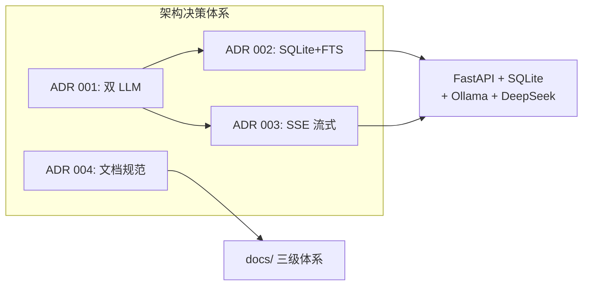

# 架构决策记录 (ADR)

📖 [中文](README-cn.md) · [English](README.md) _(same content)_

> 本目录记录了 MemWeaver 项目中的关键架构决策。每个 ADR 采用 **Context（背景）→ Decision（决策）→ Consequences（影响）** 格式，说明我们为何选择某一方案、放弃了哪些替代方案，以及该决策带来的后续影响。

---

## 现有记录

| # | 标题 | 核心决策 | 替代方案 |
|---|------|---------|---------|
| 001 | [双 LLM 架构](001-dual-llm-architecture.md) | **DeepSeek（公有）** 负责实时对话；**Ollama（本地）** 负责后台知识蒸馏与嵌入 | 单一 LLM 同时处理对话+蒸馏；纯云端方案 |
| 002 | [SQLite FTS5 而非 Postgres](002-sqlite-fts5-over-postgres.md) | **SQLite + FTS5 + sqlite-vec** 作为存储引擎 | Postgres + pgvector；MongoDB；ChromaDB |
| 003 | [SSE 流式传输模式](003-sse-streaming-pattern.md) | **Server-Sent Events** 实现逐 token 流式输出 | WebSocket；长轮询；Server Push |
| 004 | [文档管理规范化](004-document-management-canonicalization.md) | **来源草稿 → 精炼 ADR → 话题笔记** 三级文档体系，研究输出不可变保留 | 单一大文档；纯代码注释替代文档 |

---

## 决策概览

### 001 — 双 LLM 架构

将 LLM 角色拆分为 **实时对话**（DeepSeek）和 **后台蒸馏**（Ollama）。公有 LLM 处理用户交互，提供低延迟的流式回答；本地 Ollama 在后台异步完成 QA 总结、Wiki 页面生成、嵌入计算，无需用户等待。

关键取舍：牺牲了单一 LLM 的简洁性，换取了对话流畅性（用户不阻塞）和数据隐私（敏感数据不出本地）。

### 002 — SQLite FTS5 而非 Postgres

选择 SQLite + FTS5 + sqlite-vec 的"零基础设施"方案。单文件数据库、无需服务进程、BM25 全文检索内置、sqlite-vec 支持向量语义搜索。

关键取舍：放弃分布式扩展能力，换取了极简运维——整个项目可以用一个 `docker-compose up` 启动。

### 003 — SSE 流式传输

使用 Server-Sent Events 实现从 FastAPI 到 Next.js 前端的逐 token 推送。SSE 比 WebSocket 更简单（单向，基于 HTTP），比长轮询更实时。

关键取舍：选择单向协议意味着前端不能通过同一连接发送消息，但 /chat 场景恰好只需要服务器→客户端的单向流。

### 004 — 文档管理规范化

将研究输出（LLM 对谈记录）作为不可变证据保留，从中提炼出 ADR（架构决策）和话题笔记（知识总结），形成 `research/ → adr/ + topics/` 的三级体系。

关键取舍：承认 LLM 生成的研究输出有价值但冗余——保留原始记录以追溯，提炼精华以导航。

---

## 如何贡献新的 ADR

1. 将文件命名为 `NNN-title-with-hyphens.md`
2. 使用 **Context → Decision → Consequences** 模板
3. 在 Context 中说明备选方案
4. 在 Consequences 中同时说明正面和负面影响
5. 按时间顺序递增编号
