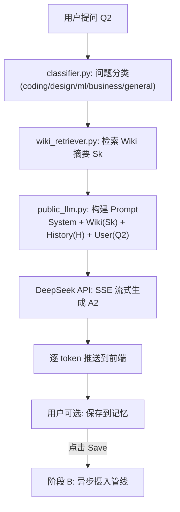
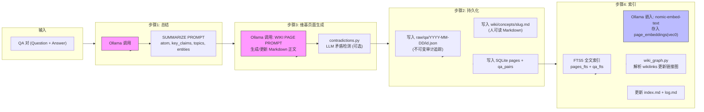
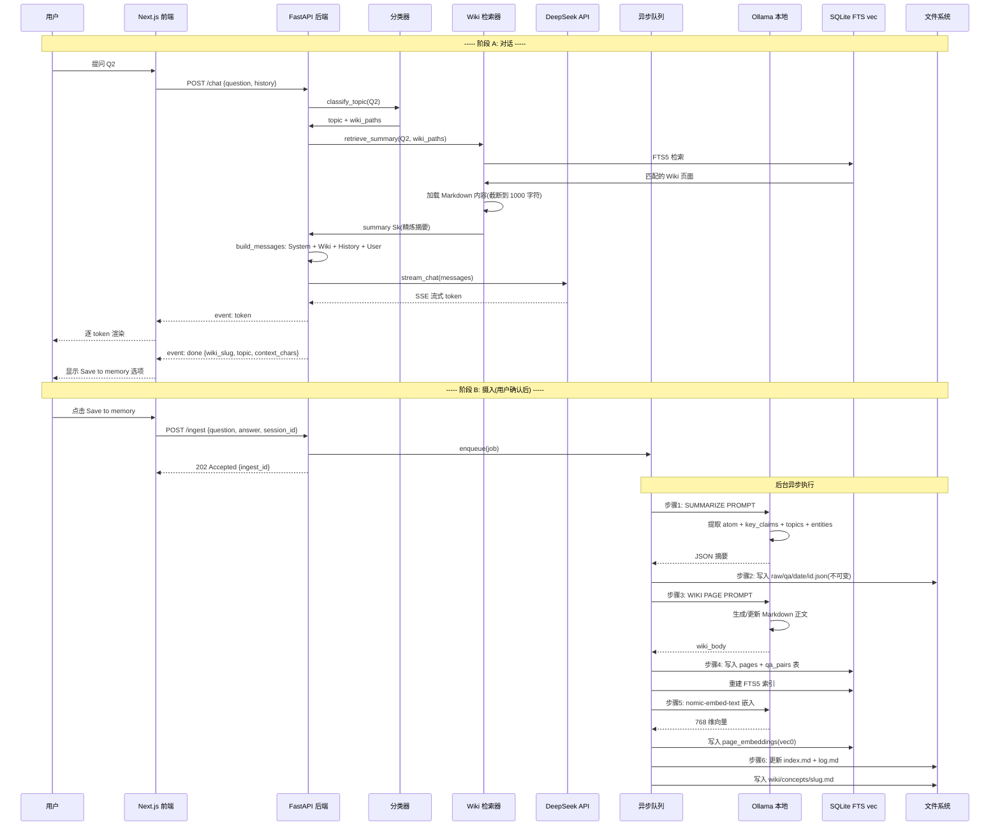
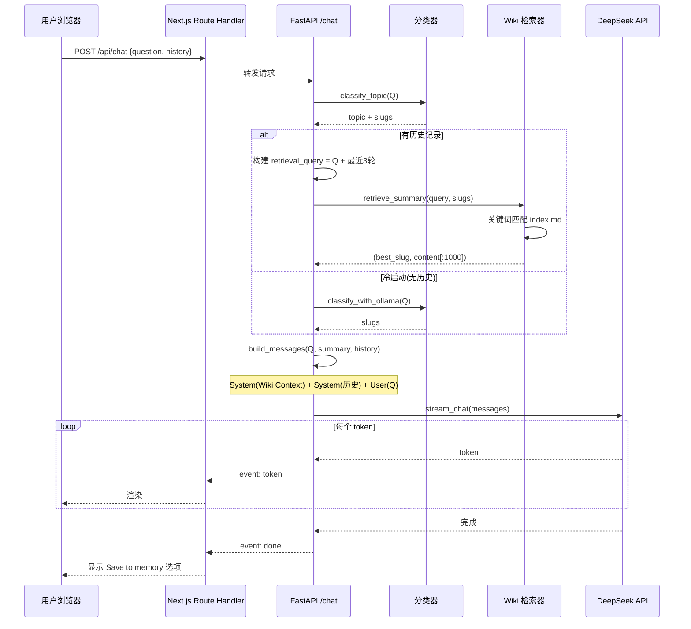
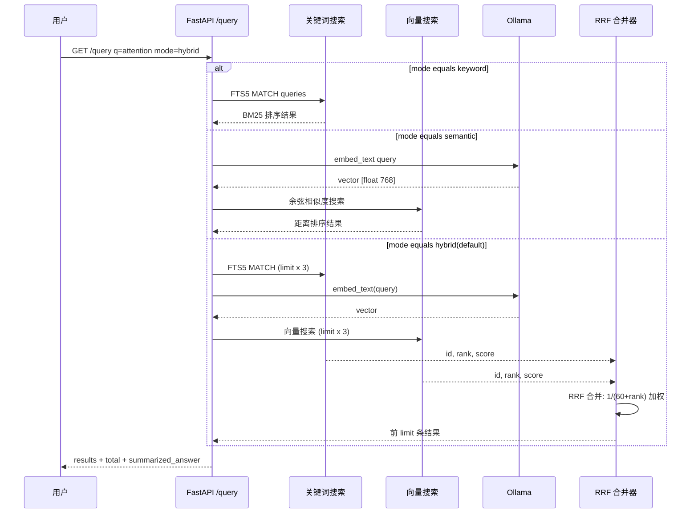
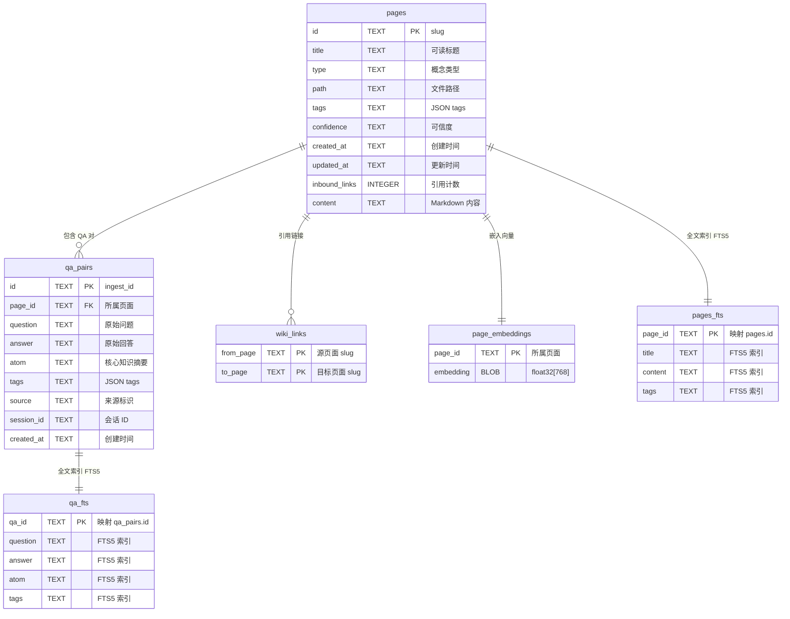
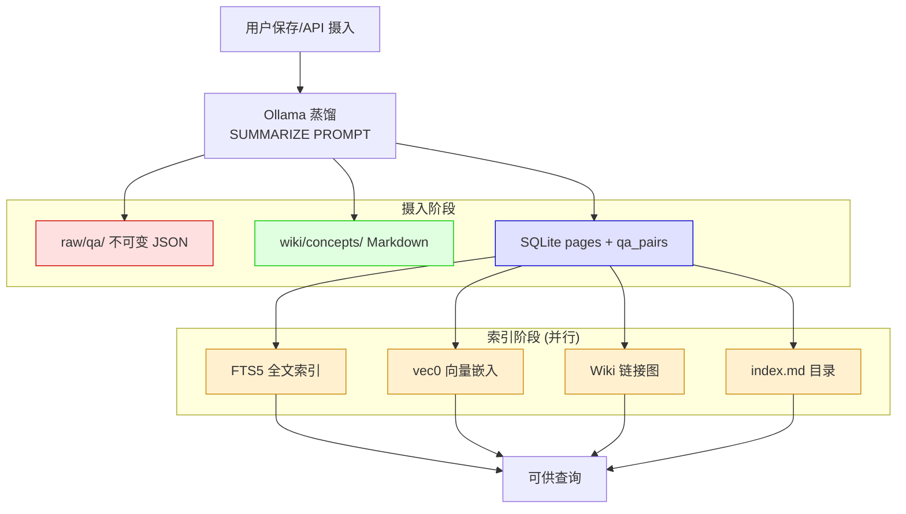
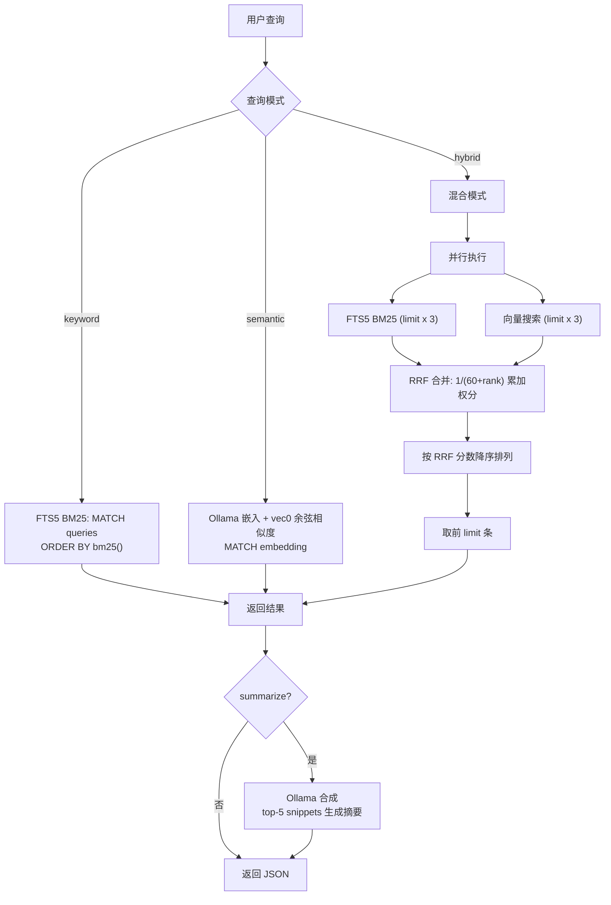
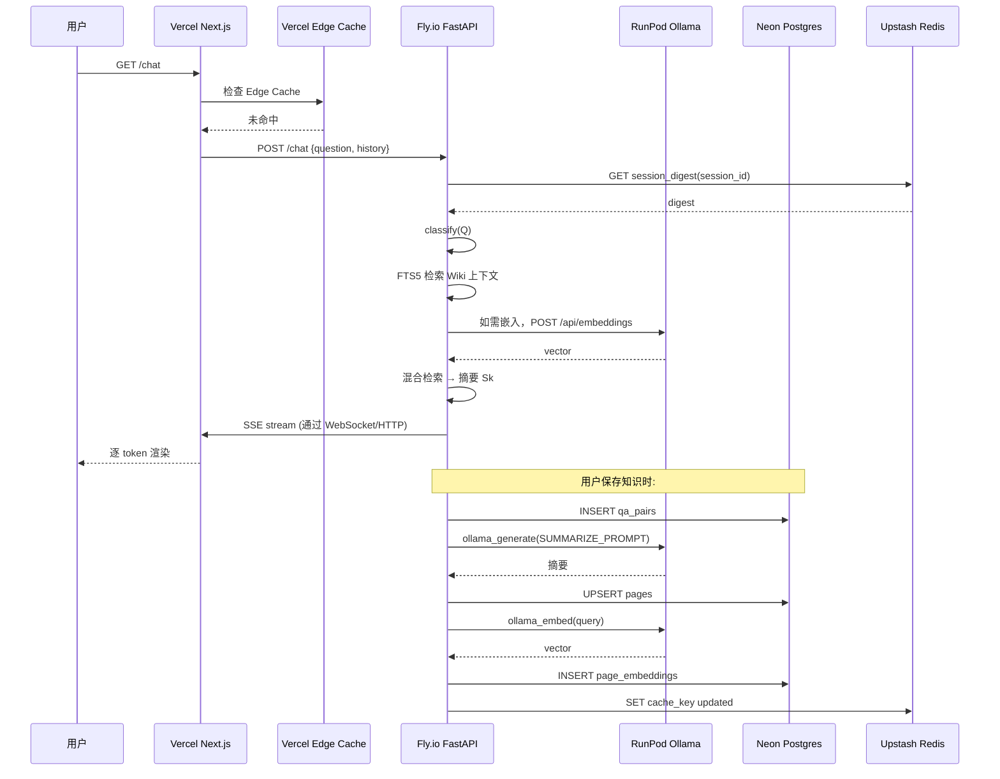
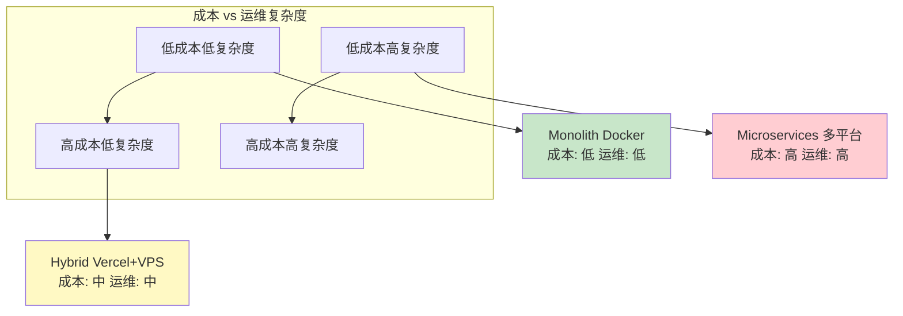

# MemWeaver 技术架构深度解析

> 版本: v0.1.0 | 最后更新: 2026-06-04
>
> 基于 [Karpathy LLM-Wiki](https://gist.github.com/karpathy/442a6bf555914893e9891c11519de94f) 的"合成记忆"理念，MemWeaver 实现了一套双模型（Dual-LLM）记忆管线——将公有 LLM 的对话问答对，通过本地 Ollama 蒸馏为结构化知识，存入 SQLite + 向量库，并在下次对话时注入检索到的浓缩上下文。

---

## 目录

1. [系统概述](#1-系统概述)
2. [核心技术框架](#2-核心技术框架)
3. [双阶段工作流](#3-双阶段工作流)
4. [数据流与交互时序](#4-数据流与交互时序)
5. [存储架构](#5-存储架构)
6. [混合检索机制](#6-混合检索机制)
7. [部署方案分析](#7-部署方案分析)
8. [关键设计决策](#8-关键设计决策)
9. [附录](#9-附录)

---

## 1. 系统概述

### 1.1 核心理念

传统 RAG（检索增强生成）在查询时检索原始文档，导致上下文臃肿且 token 浪费。MemWeaver 采用 **Ingest-Time Synthesis（摄入时合成）** 策略，将 Karpathy 的"记忆不应是检索，而应是合成"理念付诸实践：

> **摄入时**：本地 LLM 将对话 QA 提炼为结构化知识原子（Atom）→ 写入 Wiki Markdown + SQLite FTS5 + 向量库
>
> **查询时**：混合检索（BM25 + 向量相似度）召回最相关的精炼摘要 → 注入公有 LLM 的上下文窗口

### 1.2 整体架构

```
┌─────────────────────────────────────────────────────────────────────────────┐
│                              用户界面层                                      │
│  ┌───────────────────────┐    ┌─────────────────────────────────────────┐   │
│  │  Browser (localhost)  │    │  MCP Client (Cursor / Claude / CLI)    │   │
│  │  ┌─────────────────┐  │    │  ┌──────────────────────────────────┐  │   │
│  │  │ 5-Tab Dashboard │  │    │  │ wiki_search / wiki_ingest /      │  │   │
│  │  │ Compare / QA    │  │    │  │ wiki_get_page / wiki_stats       │  │   │
│  │  │ Chat / RAG /    │  │    │  └──────────────────────────────────┘  │   │
│  │  │ Wiki / Inventory│  │    └─────────────────────────────────────────┘   │
│  │  └─────────────────┘  │                                                  │
│  └──────────┬────────────┘                                                  │
└─────────────┼───────────────────────────────────────────────────────────────┘
              │ HTTP / SSE
              ▼
┌─────────────────────────────────────────────────────────────────────────────┐
│                       FastAPI 后端（Middleware Delegator）                    │
│                                                                             │
│  ┌──────────────┐  ┌──────────────┐  ┌──────────────┐  ┌───────────────┐  │
│  │  POST /chat  │  │ POST /ingest │  │  GET /query  │  │  GET /wiki/*  │  │
│  │  SSE Stream  │  │  Async Queue │  │  Hybrid      │  │  graph / tree │  │
│  │  DeepSeek    │  │  202 Accepted│  │  BM25+Vector │  │  / slug       │  │
│  └──────┬───────┘  └──────┬───────┘  └──────┬───────┘  └──────┬────────┘  │
│         │                 │                  │                 │           │
│         ▼                 ▼                  ▼                 ▼           │
│  ┌──────────────┐  ┌───────────────────────────────────────────────────┐   │
│  │  Services    │  │              Pipeline（后台工作器）                │   │
│  │  ─ classi-   │  │  ┌────────┐ ┌──────────┐ ┌──────────┐ ┌───────┐ │   │
│  │    fier      │  │  │Summa-  │ │ Wiki Body│ │ Contrad- │ │Embed- │ │   │
│  │  ─ deepseek  │  │  │rize    │→│ Generate │→│iction    │→│der    │ │   │
│  │  ─ public_llm│  │  │(Ollama)│ │(Ollama)  │ │Check     │ │(Ollama)│ │   │
│  │  ─ wiki_retr.│  │  └────────┘ └──────────┘ └──────────┘ └───────┘ │   │
│  │  ─ memory_api│  │                                                  │   │
│  └──────────────┘  └───────────────────────────────────────────────────┘   │
└─────────────────────────────────────────────────────────────────────────────┘
              │                      │                      │
              ▼                      ▼                      ▼
┌──────────────────┐  ┌──────────────────────────┐  ┌────────────────────┐
│   Ollama（本地）   │  │  SQLite + FTS5 + vec0     │  │  文件系统          │
│                  │  │                          │  │                    │
│  ┌────────────┐  │  │  ┌──────┐ ┌───────────┐  │  │  ┌──────┐         │
│  │ qwen2.5    │  │  │  │pages │ │page_embed │  │  │  │wiki/ │         │
│  │ (蒸馏/嵌入) │  │  │  │qa_pairs││ dings     │  │  │  │raw/  │         │
│  ├────────────┤  │  │  │wiki_  │ │(vec0)     │  │  │  │db/   │         │
│  │ nomic-embed│  │  │  │links  │ │           │  │  │  └──────┘         │
│  │ -text      │  │  │  └──────┘ └───────────┘  │  └────────────────────┘
│  └────────────┘  │  └──────────────────────────┘
└──────────────────┘
```

### 1.3 双模型分工

| 模型角色 | 实际模型 | 职责 | 延迟要求 |
|---------|---------|------|---------|
| **公有 LLM（Public）** | DeepSeek (deepseek-v4-flash) | 面向用户的对话、推理、回答生成 | 实时（流式 SSE） |
| **本地 LLM（Local）** | Ollama (qwen2.5:7b-instruct) | QA 蒸馏、Wiki 页面生成、矛盾检测、嵌入生成 | 异步后台（可接受 5-30s） |

---

## 2. 核心技术框架

### 2.1 技术栈总览

```
┌─────────────────────────────────────────────────────────────────┐
│                        MemWeaver 技术栈                          │
├────────────────────┬────────────────┬──────────────────────────┤
│     层次            │     技术选型     │     关键特性              │
├────────────────────┼────────────────┼──────────────────────────┤
│ Web 框架            │ FastAPI +      │ 异步原生, Pydantic v2    │
│                    │ uvicorn        │ 自动 API 文档             │
├────────────────────┼────────────────┼──────────────────────────┤
│ 前端                │ Next.js 16     │ App Router, Tailwind CSS │
│                    │ + shadcn/ui    │ SSE 代理, 5 面板仪表盘     │
├────────────────────┼────────────────┼──────────────────────────┤
│ 公有 LLM            │ DeepSeek API   │ 流式 SSE, 高速推理       │
│                    │ (deepseek-     │                          │
│                    │ v4-flash)      │                          │
├────────────────────┼────────────────┼──────────────────────────┤
│ 本地 LLM            │ Ollama         │ 本地部署, 无数据外泄      │
│                    │ (qwen2.5:7b)   │ 支持私有 API Key          │
├────────────────────┼────────────────┼──────────────────────────┤
│ 关系 + 全文检索      │ SQLite + FTS5  │ 零基础设施, BM25 排名     │
│                    │ (aiosqlite)    │ porter 分词器             │
├────────────────────┼────────────────┼──────────────────────────┤
│ 向量检索             │ sqlite-vec     │ 768 维 float 向量       │
│                    │ (vec0 虚拟表)   │ 同一 SQLite 文件内        │
├────────────────────┼────────────────┼──────────────────────────┤
│ 嵌入模型             │ nomic-embed-   │ 768 维, 8192 token      │
│                    │ text (Ollama)  │                          │
├────────────────────┼────────────────┼──────────────────────────┤
│ 配置                 │ pydantic-      │ .env 文件, 12-factor    │
│                    │ settings       │ 类型安全                  │
├────────────────────┼────────────────┼──────────────────────────┤
│ HTTP 客户端          │ httpx (async)  │ 超时控制, 重试机制        │
├────────────────────┼────────────────┼──────────────────────────┤
│ IDE 集成            │ FastMCP (stdio)│ 4 个 MCP 工具            │
│                    │ MCP Server     │ wiki_search / ingest     │
│                    │                │ / get_page / stats       │
├────────────────────┼────────────────┼──────────────────────────┤
│ 测试                 │ pytest +       │ 异步测试, 17 个测试文件   │
│                    │ pytest-asyncio │                          │
└────────────────────┴────────────────┴──────────────────────────┘
```

### 2.2 目录结构

```
mem-weaver/                          # 项目根目录
├── server/                          # FastAPI 后端
│   ├── main.py                      # 路由: /ingest, /chat, /query, /wiki/*
│   ├── config/settings.py           # 类型安全配置 (pydantic-settings)
│   ├── models/api.py                # Pydantic 请求/响应模型
│   ├── pipeline/                    # 摄入管线
│   │   ├── ingest_worker.py         # 后台异步摄入编排
│   │   ├── embedder.py              # Ollama 嵌入 + sqlite-vec 写入
│   │   ├── query_search.py          # 混合搜索 (FTS + 向量 + RRF)
│   │   ├── search_semantic.py       # 纯向量搜索
│   │   ├── contradictions.py        # LLM 矛盾检测
│   │   ├── wiki_files.py            # index.md / log.md 维护
│   │   ├── wiki_graph.py            # Wiki 链接图维护
│   │   ├── prompts.py               # Ollama 提示词
│   │   └── textutil.py              # 文本工具函数
│   ├── services/                    # 服务层
│   │   ├── public_llm.py            # 公有 LLM 消息构建
│   │   ├── deepseek_client.py       # DeepSeek API 流式客户端
│   │   ├── wiki_retriever.py        # Wiki 摘要检索
│   │   ├── classifier.py            # 问题分类
│   │   ├── memory_api.py            # 摄入 + 队列管理
│   │   ├── wiki_graph_api.py        # 图数据 API
│   │   └── wiki_tree_api.py         # 树形目录 API
│   ├── db/
│   │   ├── database.py              # SQLite 连接 + 迁移
│   │   ├── vec.py                   # sqlite-vec 扩展加载
│   │   └── migrations/              # SQL 迁移
│   │       ├── 001_init.sql         # 基础表 + FTS5
│   │       └── 002_semantic_search.sql  # vec0 向量表
│   └── ollama/client.py             # Ollama HTTP 客户端
├── chat-app/                        # Next.js 16 前端
│   └── app/
│       ├── page.tsx                 # 5 面板仪表盘
│       └── api/chat/route.ts        # SSE 代理 Route Handler
├── wiki/                            # LLM-Wiki Markdown 保险库
│   ├── concepts/                    # 蒸馏后的知识页面
│   ├── index.md                     # 内容目录
│   └── log.md                       # 追加式操作日志
├── raw/qa/                          # 不可变的原始 QA JSON
└── db/wiki.db                       # SQLite 数据库文件
```

---

## 3. 双阶段工作流

### 3.1 阶段 A: 对话 + 上下文注入（Phase A — Chat + Context Injection）

当用户发出一条新问题时，系统执行以下流程：



**关键特性**：

- **非阻塞**：DeepSeek 流式输出（Server-Sent Events），用户看到逐 token 生成
- **上下文三重注入**：Wiki 摘要 + 近期历史 + 会话摘要（长会话时自动压缩）
- **保存为手动加入**：回答完成后用户勾选"Save to memory"才触发摄入，不自动保存
- **状态分类**：`cold`（无历史）、`warm`（1-2 轮）、`rich`（3+ 轮），不同状态决定上下文策略

### 3.2 阶段 B: 异步摄入管线（Phase B — Async Ingest Pipeline）

当用户选择保存 QA 对或通过 API 直接 `/ingest` 时，后台工作器执行以下蒸馏管线：



### 3.3 完整双阶段循环



---

## 4. 数据流与交互时序

### 4.1 聊天数据流



### 4.2 摄入数据流

```mermaid
sequenceDiagram
    participant U as 用户 CLI
    participant F as FastAPI /ingest
    participant Q as asyncio Queue
    participant W as Worker 管线
    participant O as Ollama
    participant FS as 文件系统
    participant DB as SQLite

    U->>F: POST /ingest {question, answer, source, tags}
    F->>F: Pydantic 校验
    F->>Q: enqueue(IngestJob)
    F-->>U: 202 Accepted {ingest_id}

    loop 后台消费队列
        Q->>W: dequeue(job)
        
        W->>O: ollama_generate_json(SUMMARIZE_PROMPT)
        O-->>W: {atom, key_claims, topics, entities}

        W->>FS: 写入 raw/qa/date/id.json

        W->>O: ollama_generate_text(WIKI_PAGE_PROMPT)
        O-->>W: wiki_body(markdown)

        W->>W: maybe_prepend_contradiction_block()
        Note over W: 如启用, 检查新知识是否与页面矛盾

        W->>FS: 写入 wiki/concepts/slug.md

        W->>DB: UPSERT pages 表
        W->>DB: INSERT qa_pairs
        W->>DB: 重建 FTS5 索引

        W->>O: ollama embed(nomic-embed-text)
        O-->>W: [float; 768]
        W->>DB: INSERT page_embeddings(vec0)

        W->>FS: 更新 index.md + log.md

        W->>W: wiki_graph.sync_outbound_links()
        W->>DB: UPDATE inbound_links
        
        Q-->>Q: task_done()
    end
```

### 4.3 查询数据流



---

## 5. 存储架构

### 5.1 三位一体存储模型

MemWeaver 使用三种相互关联的存储介质，同一份知识被以不同形式同步写入：

```
┌─────────────────────────────────────────────────────────────────────┐
│                     三位一体存储架构                                  │
│                                                                     │
│  ┌─────────────────┐    ┌──────────────────┐    ┌───────────────┐   │
│  │   文件系统        │    │   SQLite 数据库    │    │  sqlite-vec   │   │
│  │   (人类可读)      │    │   (结构化检索)      │    │  (语义搜索)    │   │
│  ├─────────────────┤    ├──────────────────┤    ├───────────────┤   │
│  │                 │    │                  │    │               │   │
│  │ raw/qa/         │    │  pages           │    │ page_embeddings│   │
│  │  └─ YYYY-MM-DD/ │    │  qa_pairs        │    │ (vec0 虚拟表)  │   │
│  │      └─ id.json │◄──►│  wiki_links      │    │  float[768]   │   │
│  │  (审计追踪)      │    │                  │    │               │   │
│  │                 │    │  pages_fts (FTS5) │    │               │   │
│  │ wiki/concepts/  │    │  qa_fts (FTS5)    │    │               │   │
│  │  └─ slug.md     │    │                  │    │               │   │
│  │  (Obsidian 兼容) │    │  BM25 关键词索引   │    │  余弦距离检索  │   │
│  │                 │    │                  │    │               │   │
│  └─────────────────┘    └──────────────────┘    └───────────────┘   │
│          │                      │                      │            │
│          └──────────┬───────────┴───────────┬──────────┘            │
│                     │                       │                        │
│                     ▼                       ▼                        │
│              ┌─────────────────────────────────┐                     │
│              │     index.md + log.md           │                     │
│              │     (Wiki 目录 + 变更日志)       │                     │
│              └─────────────────────────────────┘                     │
└─────────────────────────────────────────────────────────────────────┘
```

### 5.2 SQLite 表结构



### 5.3 数据生命周期



---

## 6. 混合检索机制

### 6.1 三种查询模式

| 模式 | 引擎 | 适用场景 | 排序依据 |
|------|------|---------|---------|
| `keyword` | FTS5 BM25 | 精确关键词匹配，如搜索"RAG"应找到 RAG 页面 | BM25 分数（负值，越负匹配越好） |
| `semantic` | vec0 余弦距离 | 概念匹配，如搜索"测试方法论"应找到"冒烟测试" | 余弦距离（正值，越小越相似） |
| `hybrid` | RRF 融合 | 需要精确+语义双优 | 倒数秩融合(1/(60+rank)) |



### 6.2 RRF 融合算法

混合搜索的核心是倒数秩融合（Reciprocal Rank Fusion）：

```
RRF_score(page) = 1/(k + rank_FTS(page)) + 1/(k + rank_VEC(page))

其中 k = 60（标准 RRF 常数）
```

**特性**：
- 在一个通道排名高但在另一个通道排名低的页面仍能获得良好总分
- 在两个通道都有得分的页面获得增强
- 即使某一通道未召回该页面，RRF 分数仅由另一通道贡献

---

## 7. 部署方案分析

### 7.1 方案 A: 单体部署 — Docker + Vercel

#### 架构

```
┌──────────────────────────────────────────────────────────────────────┐
│                         Vercel 平台                                  │
│                                                                     │
│  ┌────────────────────────────────────────────────────────────────┐ │
│  │  Vercel Functions (Serverless)                                  │ │
│  │  ┌──────────────────────────────┐                               │ │
│  │  │  Next.js 前端 (chat-app/)     │                               │ │
│  │  │  SSR / SSE Proxy / API Route │                               │ │
│  │  └──────────────────────────────┘                               │ │
│  └────────────────────────────────────────────────────────────────┘ │
│                                                                     │
│  ┌────────────────────────────────────────────────────────────────┐ │
│  │  Docker 容器 (VPS / Railway / Fly.io)                           │ │
│  │                                                                 │ │
│  │  ┌──────────────┐  ┌──────────────┐  ┌──────────────────────┐  │ │
│  │  │ FastAPI 后端  │  │   Ollama     │  │   SQLite + vec0      │  │ │
│  │  │ uvicorn      │  │  qwen2.5:7b  │  │   FTS5 / 向量        │  │ │
│  │  │ + DeepSeek   │  │  nomic-embed │  │   / 文件系统         │  │ │
│  │  │ API Client   │  │  -text      │  │   写入                │  │ │
│  │  └──────────────┘  └──────────────┘  └──────────────────────┘  │ │
│  └────────────────────────────────────────────────────────────────┘ │
│                                                                     │
│  ┌────────────────────────────────────────────────────────────────┐ │
│  │  网络连接                                                      │ │
│  │  Next.js → FastAPI (内部网络或公共端点)                          │ │
│  │  FastAPI → DeepSeek API (外部互联网)                            │ │
│  │  FastAPI → Ollama (localhost / Unix Socket)                     │ │
│  └────────────────────────────────────────────────────────────────┘ │
└──────────────────────────────────────────────────────────────────────┘
```

#### Dockerfile

```dockerfile
FROM python:3.12-slim

WORKDIR /app

# 安装运行依赖
COPY requirements.txt .
RUN pip install --no-cache-dir -r requirements.txt

# 复制应用代码
COPY server/ server/
COPY wiki/ wiki/
COPY raw/ raw/
COPY db/ db/

# Ollama 作为依赖容器或服务边车
# 本例假设 Ollama 通过 OLLAMA_HOST 指向外部服务

EXPOSE 8000
CMD ["uvicorn", "server.main:app", "--host", "0.0.0.0", "--port", "8000"]
```

```yaml
# docker-compose.yml
version: "3.9"
services:
  ollama:
    image: ollama/ollama:latest
    volumes:
      - ollama_data:/root/.ollama
    ports:
      - "11434:11434"
    deploy:
      resources:
        reservations:
          devices:
            - driver: nvidia
              count: 1
              capabilities: [gpu]

  backend:
    build: .
    ports:
      - "8000:8000"
    environment:
      - OLLAMA_HOST=http://ollama:11434
      - DEEPSEEK_API_KEY=${DEEPSEEK_API_KEY}
      - DEEPSEEK_MODEL=deepseek-v4-flash
    volumes:
      - wiki_data:/app/wiki
      - raw_data:/app/raw
      - db_data:/app/db
    depends_on:
      - ollama

volumes:
  ollama_data:
  wiki_data:
  raw_data:
  db_data:
```

#### 方案 A 优缺点

| 方面 | 评估 |
|------|------|
| **优势** | 部署简单，一个 compose 启动全部；数据一致性强（单 SQLite 文件）；网络延迟低（Ollama 本地调用）；运维成本低 |
| **劣势** | Ollama 需要 GPU，Vercel Serverless 无法运行；前端和后端物理分离需网络连接；扩展性受限（Ollama 是单体瓶颈）；Vercel 前端需要配置后端 URL |
| **成本** | Docker VPS $5-20/月 + Vercel Hobby 免费 / Pro $20/月 |
| **适用** | 个人项目、小团队、原型验证、开发环境 |

**关键挑战**：Ollama 需要 GPU/CPU 资源，无法在 Vercel Serverless 环境中运行。解决方案：

1. **双平台部署**：Next.js 在 Vercel Serverless，FastAPI + Ollama 在独立 VPS
2. **Kubernetes**：Ollama 作为一个有 GPU 资源调度的 Pod
3. **托管 Ollama 服务**：使用 [Groq Cloud](https://groq.com)、[Together AI](https://together.ai) 或自托管 Ollama API

### 7.2 方案 B: 微服务多平台部署

#### 架构

```
┌───────────────────────────────────────────────────────────────────────────────┐
│                        多平台微服务部署                                         │
│                                                                               │
│  ┌─────────────────────┐  ┌─────────────────────┐  ┌───────────────────────┐  │
│  │  Vercel             │  │  VPS / Fly.io        │  │  GPU Cloud           │  │
│  │                     │  │                      │  │  (RunPod /         │  │
│  │  ┌───────────────┐  │  │  ┌───────────────┐  │  │   Banana / Replicate)│  │
│  │  │ Next.js 16    │  │  │  │ FastAPI        │  │  └───────────────────────┘  │
│  │  │ (App Router)  │  │  │  │ (uvicorn)      │  │         │                  │
│  │  │ + Edge Cache  │◄─┼──┼──│ + DeepSeek     │  │         │ HTTP             │
│  │  └───────────────┘  │  │  │ API Client     │  │         ▼                  │
│  └─────────────────────┘  │  └───────┬────────┘  │  ┌───────────────────────┐  │
│                            │          │           │  │ Ollama 服务           │  │
│  ┌─────────────────────┐  │          │           │  │                       │  │
│  │  Vercel KV          │  │          ▼           │  │  ┌─────────────────┐  │  │
│  │  (Edge Config)      │  │  ┌───────────────┐  │  │  │ qwen2.5:7b     │  │  │
│  │  ─ 会话缓存          │  │  │ SQLite + FTS5 │  │  │  │ (蒸馏/生成)     │  │  │
│  │  ─ 热点 Wiki 缓存    │  │  │ + vec0        │  │  │  └─────────────────┘  │  │
│  └─────────────────────┘  │  │ (单文件)       │  │  │  ┌─────────────────┐  │  │
│                            │  └───────────────┘  │  │  │ nomic-embed-text│  │  │
│  ┌─────────────────────┐  │                      │  │  │ (嵌入)          │  │  │
│  │  Managed Postgres    │  │  ┌───────────────┐  │  │  └─────────────────┘  │  │
│  │  (Neon / Supabase)   │  │  │ Wiki + Raw    │  │  └───────────────────────┘  │
│  │  ─ 持久化存储可选项   │  │  │ (文件系统卷)   │  │                           │
│  │  ─ 替代 SQLite       │  │  └───────────────┘  │                           │
│  └─────────────────────┘  └──────────────────────┘                           │
└───────────────────────────────────────────────────────────────────────────────┘
```

#### 服务拆分

| 服务 | 平台 | 技术 | 职责 |
|------|------|------|------|
| **Web 前端** | Vercel | Next.js 16 + Edge | 用户界面、SSE 代理、Edge Cache |
| **API 后端** | Fly.io / Railway | FastAPI + uvicorn | 路由、查询、摄入编排 |
| **推理服务** | RunPod / Banana | Ollama + GPU | LLM 蒸馏、Wiki 生成、嵌入 |
| **数据库** | Fly.io Volume / Neon | SQLite / Postgres | 持久化存储 |
| **缓存** | Vercel KV / Upstash | Redis | 会话缓存、热点缓存 |

#### 微服务通信



#### 方案 B 优缺点

| 方面 | 评估 |
|------|------|
| **优势** | 独立扩展（GPU 推理可单独扩）；失败隔离（Ollama 宕机不影响前端）；多区域部署（全球低延迟）；技术栈灵活（可替换组件） |
| **劣势** | 运维复杂度高；网络延迟增加（跨服务调用）；数据一致性问题（分布式 SQLite 困难）；成本增加（多服务多平台） |
| **成本** | Vercel Pro $20 + Fly.io $10-30 + RunPod GPU $0.5-2/小时 + Neon Free/Pro $0-19 |
| **适用** | 团队协作、生产环境、需要独立扩展的场景 |

**关键挑战**：

1. **SQLite 局限**：SQLite 是单文件数据库，不适合分布式部署。替代方案：
   - 使用 Neon / Supabase (Postgres) + pgvector 替代 SQLite + sqlite-vec
   - 文件系统（wiki/raw/）迁移到 S3 兼容对象存储

2. **Ollama 无状态化**：Ollama 模型需要通过 GPU Cloud 暴露为 HTTP API 端点，每次推理调用独立

3. **数据同步**：Wiki Markdown 文件在多副本间同步需使用对象存储 + CDN

### 7.3 方案对比



| 维度 | 方案 A: Docker 单体 | 方案 B: 微服务多平台 | 推荐 |
|------|-------------------|-------------------|------|
| **部署难度** | ⭐⭐⭐（简单） | ⭐（复杂） | **A** |
| **扩展性** | ⭐ | ⭐⭐⭐（优质） | **B** |
| **GPU 利用率** | ⭐⭐（共享） | ⭐⭐⭐（独立） | **B** |
| **全局延迟** | ⭐⭐（单区域） | ⭐⭐⭐（多区域） | **B** |
| **数据一致性** | ⭐⭐⭐（强） | ⭐⭐（最终） | **A** |
| **成本(月)** | $15-40 | $50-200+ | **A** |
| **运维负担** | ⭐⭐⭐（低） | ⭐（高） | **A** |
| **适合阶段** | 原型/个人/小团队 | 生产/团队/企业 | — |

### 7.4 混合推荐方案

对于大多数场景，推荐 **混合方案**（Hybrid: Vercel + VPS）：

```
┌───────────────────────────────────────────────────────────────────────┐
│                       推荐部署: 混合方案                               │
│                                                                       │
│  ┌─────────────────────────────┐              ┌────────────────────┐  │
│  │  Vercel                      │              │  VPS / Fly.io      │  │
│  │                             │              │                    │  │
│  │  Next.js 16 前端            │  HTTP/SSE    │  FastAPI 后端      │  │
│  │  + 静态资产                 │◄────────────►│  + DeepSeek Client │  │
│  │  + Edge Cache              │              │  + SQLite + vec0   │  │
│  │  + Vercel KV (Redis)       │              │  + Wiki/Raw 文件    │  │
│  └─────────────────────────────┘              │  + Ollama 客户端    │  │
│                                                └────────┬───────────┘  │
│                                                          │              │
│                                                          ▼              │
│                                                ┌────────────────────┐  │
│                                                │  Ollama (本地)      │  │
│                                                │  qwen2.5:7b        │  │
│                                                │  nomic-embed-text  │  │
│                                                │  (无需 GPU 也可跑)  │  │
│                                                └────────────────────┘  │
└───────────────────────────────────────────────────────────────────────┘
```

**原因**：

1. Vercel 提供最好的前端托管（全球 CDN、零配置 HTTPS、Edge Functions）
2. VPS 运行 FastAPI + SQLite + Ollama CPU 推理（qwen2.5:7b 在 CPU 上可行）
3. 未来可平滑升级：Ollama 拆分为独立 GPU 服务 → 过渡到方案 B

---

## 8. 关键设计决策

| 决策 | 选择 | 替代方案 | 原因 |
|------|------|---------|------|
| **摄入模式** | 异步队列 + 202 响应 | 同步等待管线结果 | LLM 调用需 5-30s，不应阻塞调用方 |
| **数据库** | SQLite + FTS5 + vec0 | Postgres + pgvector | 零基础设施、单文件、足够小团队规模 |
| **Wiki 格式** | Markdown + YAML frontmatter | 纯数据库 | 人类可读、Obsidian 兼容、Git 原生版本控制 |
| **公有 LLM** | DeepSeek API | OpenAI / Claude API | 性价比高、速度快、支持流式输出 |
| **本地 LLM** | Ollama qwen2.5:7b | 仅用公有 LLM | 数据隐私、离线能力、避免每一轮调用云端 API |
| **矛盾处理** | 追加警告块引用 | 静默覆盖 | 保留溯源，人工判断 |
| **对话保存** | 手动加入（opt-in） | 自动保存每一轮 | 由用户判断哪些对话值得蒸馏 |
| **原始数据** | 不可变 JSON 文件 | 数据库覆盖 | 审计追踪，`git revert` 可回滚 |

---

## 9. 附录

### 9.1 核心配置项

```env
# .env — 核心配置
OLLAMA_HOST=http://127.0.0.1:11434
OLLAMA_MODEL=qwen2.5:7b-instruct
OLLAMA_TIMEOUT=120
OLLAMA_API_KEY=              # 私有化部署 Ollama API Key

DEEPSEEK_API_KEY=sk-xxx      # DeepSeek API Key
DEEPSEEK_MODEL=deepseek-v4-flash
DEEPSEEK_BASE_URL=https://api.deepseek.com/v1/chat/completions

WIKI_DIR=wiki                # Wiki 目录
RAW_DIR=raw/qa               # 原始 QA 目录
DB_PATH=db/wiki.db           # SQLite 数据库路径

MAX_QUEUE_SIZE=100           # 摄入队列最大长度
ENABLE_CONTRADICTION_CHECK=false  # 是否启用矛盾检测(额外 LLM 调用)
```

### 9.2 API 端点汇总

| 方法 | 路径 | 描述 | 响应格式 |
|------|------|------|---------|
| `POST` | `/chat` | 流式对话（SSE），带 Wiki 上下文注入 | `event: token` / `event: done` |
| `POST` | `/ingest` | 提交 QA 对异步摄入 | 202 + `ingest_id` |
| `GET` | `/query` | 搜索知识（keyword/semantic/hybrid） | JSON 结果列表 |
| `GET` | `/wiki/{slug}` | 获取 Wiki Markdown 内容 | `{slug, content}` |
| `GET` | `/wiki/graph` | Wiki 页面节点 + 链接边 | `{nodes[], edges[]}` |
| `GET` | `/wiki/tree` | 侧边栏目录树 | JSON 嵌套结构 |
| `GET` | `/health` | 服务健康检查 | `{ollama, db, queue_depth}` |
| `GET` | `/stats` | 聚合统计 | `{wiki_pages, qa_pairs, tags}` |
| `GET` | `/inventory` | 全数据存储盘点 | `{raw_qa, concepts, db, index, log}` |

### 9.3 相关文档

- [Karpathy LLM-Wiki Gist](https://gist.github.com/karpathy/442a6bf555914893e9891c11519de94f) — 原始理念
- [Collect → Distill → Ingest 方法论](file:///Users/william.jiang/my-playgrounds/mem-weaver-app/mem-weaver/docs/guides/collect-distill-ingest.md)
- [架构决策记录 — ADR 001: 双 LLM 架构](file:///Users/william.jiang/my-playgrounds/mem-weaver-app/mem-weaver/docs/adr/001-dual-llm-architecture.md)
- [LLM-Wiki 模式规范](file:///Users/william.jiang/my-playgrounds/mem-weaver-app/mem-weaver/wiki/LLM_WIKI_SCHEMA.md)
- [实施计划 v2](file:///Users/william.jiang/my-playgrounds/mem-weaver-app/mem-weaver/docs/research/v2/s2-claude-plan.md)
